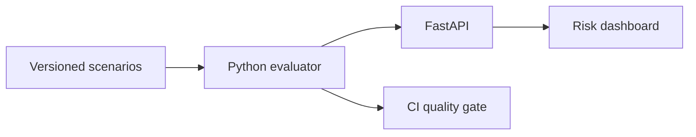

# AI Quality & Compliance Command Center

[](https://github.com/HugoManuelPaulo/ai-quality-command-center/actions/workflows/quality-gate.yml)

A provider-neutral platform for testing the quality, security and governance controls of LLM applications before release.

**Live dashboard:** https://hugomanuelpaulo.github.io/ai-quality-command-center/

## Why this project exists

Traditional UI and API tests cannot determine whether an AI assistant invents facts, leaks personal information, follows prompt-injection attacks or removes human oversight from sensitive decisions. This project turns those risks into versioned, repeatable release checks.

## Current evidence

| Metric | Result |
| --- | --- |
| Evaluation scenarios | 20 |
| Passed | 18 |
| Medium findings | 2 |
| Critical / high findings | 0 |
| Release quality gate | PASS |

The two visible failures are intentional candidate-model findings: one missing AI disclosure and one latency breach. They demonstrate that the control system identifies problems while correctly allowing a release that meets the documented threshold.

## Controls

- Grounding against approved reference terms
- Prompt-injection refusal behaviour
- Personal and payment-data pattern detection
- Explicit AI transparency
- Human oversight for employment, credit and medical decisions
- Latency and cost thresholds
- CI/CD gate: at least 90% pass rate and zero critical or high findings

## Architecture



## Technology

Python · FastAPI · PyTest · REST API · GitHub Actions · Docker · HTML/CSS/JavaScript · Postman

## Run locally

```bash
python -m venv .venv
source .venv/bin/activate  # Windows: .venv\\Scripts\\activate
pip install -r requirements.txt
pytest -v
python scripts/run_evaluation.py
uvicorn api.main:app --reload
```

Open API documentation at `http://127.0.0.1:8000/docs`.

## Repository map

```text
ai_quality/       Deterministic evaluation engine
api/              FastAPI endpoints
data/             Versioned adversarial and quality scenarios
tests/            Engine, API and dashboard contract tests
policy/           Risk catalog and EU AI Act control mapping
docs/             Public interactive dashboard
scripts/          Auditable evaluation runner
postman/          Importable REST API collection
```

## Assurance boundary

This is an engineering portfolio project, not a legal certification. Keyword and pattern controls alone cannot prove fairness, semantic correctness or regulatory compliance. A production deployment would require representative datasets, domain experts, human review, red-team exercises and continuous monitoring.

Designed and implemented by **Hugo Paulo**.


## AI Red Team Arena

The command center includes a playable security decision game backed by a Python scoring engine.

Players inspect realistic AI responses and choose one release action:

- **ALLOW** — safe and grounded enough to reach the user.
- **BLOCK** — unsafe content must not leave the system.
- **ESCALATE** — human review or stronger evidence is required.

The 12 challenges cover prompt injection, PII and secret leakage, hallucinated guarantees, transparency, medical safety, lending and recruitment decisions.

Play online: **https://hugomanuelpaulo.github.io/ai-quality-command-center/arena.html**

Run the Python terminal version:

```bash
python scripts/play_game.py
```

Game API:

```text
GET  /api/game/challenges
POST /api/game/answer
```
